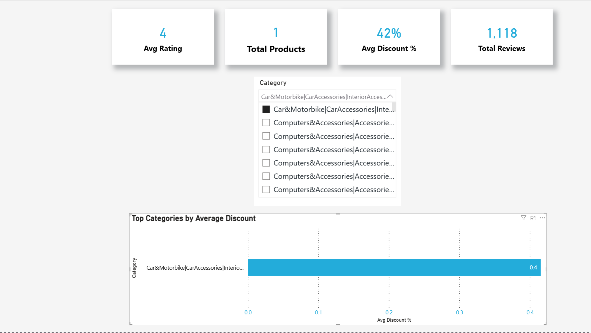

# Amazon Pricing Dashboard (Power BI)

Interactive Power BI dashboard analyzing Amazon pricing trends and discount behavior through KPI-driven reporting and category-level comparison.

---

## Project Overview

This project presents an interactive Power BI dashboard developed from cleaned Amazon marketplace data.  
The objective was to visualize pricing patterns, discount behavior, and category performance using structured data modeling and DAX measures.

The dashboard focuses on delivering clear, decision-oriented insights through dynamic filtering and KPI visualization.

---

## Dashboard Preview

  

---

## Dashboard Features

- KPI cards (Average Rating, Total Products, Average Discount %, Total Reviews)  
- Category slicer for dynamic filtering  
- Category-level comparison of average discount percentage  
- Clean executive-style layout for reporting clarity  

---

## Key Skills Demonstrated

- Data modeling in Power BI  
- DAX measure creation  
- KPI development and performance tracking  
- Interactive dashboard design  
- Category-level comparative analysis  
- Business-focused data visualization  

---

## Tools Used

- Power BI  
- DAX  
- Data modeling techniques  

---

## Project Structure

dashboard/ # Power BI (.pbix) file
screenshots/ # Dashboard image previews
README.md # Documentation

---

## Business Relevance

This dashboard demonstrates how pricing and discount behavior can be analyzed visually to support reporting, performance tracking, and category-level evaluation. It reflects practical business intelligence principles applied to marketplace data.
