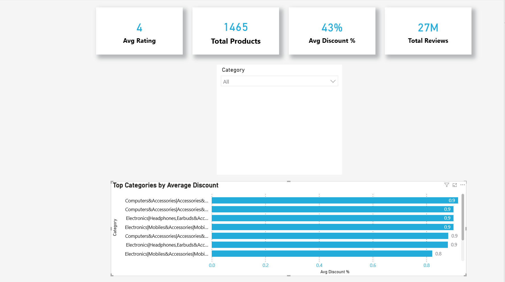

 amazon-pricing-dashboard
Interactive Power BI dashboard analyzing Amazon pricing trends and discount behavior.

 Amazon Pricing Dashboard (Power BI)

 Overview:
This project presents an interactive Power BI dashboard built from cleaned Amazon marketplace data. The goal is to highlight pricing patterns, discount behavior, and category-level performance through clear KPIs and filters.

 Dashboard Preview:
 

 Dashboard Features:
 KPI cards (Avg Rating, Total Products, Avg Discount %, Total Reviews)
 Category slicer for quick filtering
 Category-level comparison of average discount %

 Tools Used:
 Power BI
 DAX
 Data modeling

 Project Structure:
 dashboard/ Power BI file (.pbix)
 screenshots Dashboard image previews
 README.md Documentation
