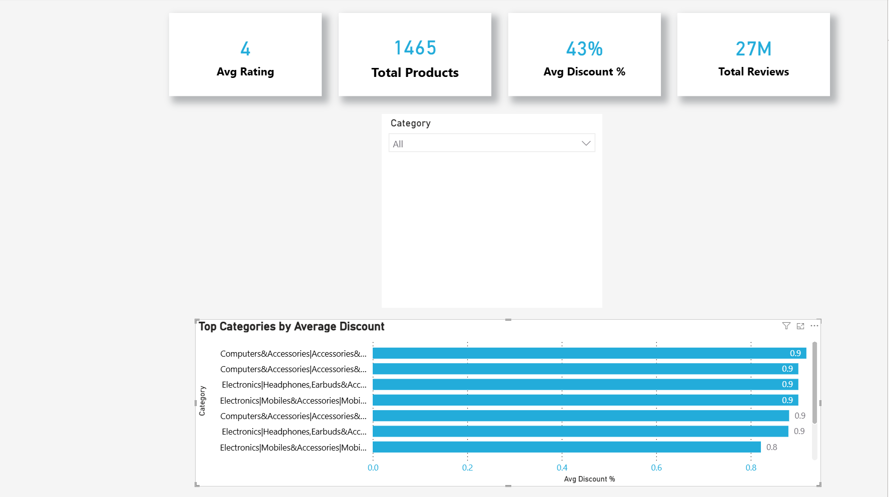
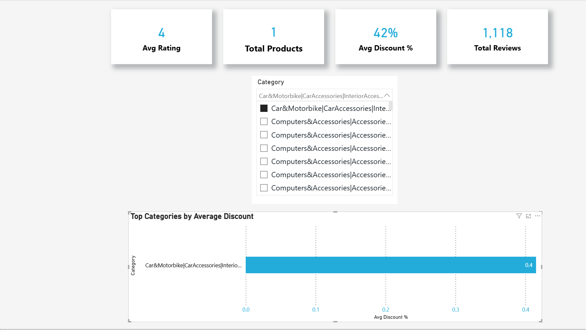

# Amazon Pricing Dashboard

This project shows a Power BI dashboard built to review pricing and discount trends across Amazon product categories.

---

## Dashboard Preview

### Overview

### Filtered View

---

## Why I Built It

I created this dashboard to make the pricing data easier to read and compare. Instead of checking raw numbers one by one, the dashboard brings key metrics, category filters, and visuals into one place.

---

## Dashboard Highlights

- Interactive filters to compare categories
- KPI cards for prices and discounts
- DAX measures for key calculations
- Visuals that make trends easier to review

---

## Key Takeaways

- Some categories had higher average discounts
- Prices changed across different product groups
- The dashboard made those differences easier to spot

---

## Tools

- Power BI
- DAX
